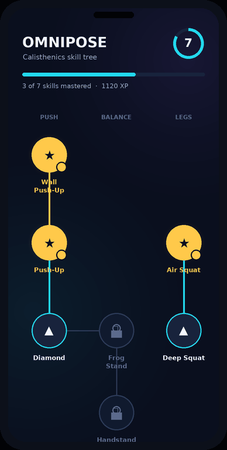

# ⚡ OmniPose Fit — Dynamic Calisthenics & Movement Engine

OmniPose Fit is a real-time, computer-vision-powered fitness app that tracks
workout repetitions, corrects posture dynamically based on geometric
constraints, and gamifies calisthenics skill progressions — wrapped in a
premium dark-mode experience with vibrant accent feedback.

Built with **Kotlin**, **Jetpack Compose**, **CameraX** and **ML Kit Pose
Detection**.

<p align="center">
  
</p>

<p align="center"><sub>UI preview — rendered from the app's real design system (palette, layouts and component behaviour). Not a device screen recording.</sub></p>

## 📲 Install on your Android

Prebuilt APKs are published on the repo's
[**Releases**](../../releases) page (produced by the
[`Build & Release APK`](.github/workflows/release-apk.yml) GitHub Action).

1. Open the latest release and download **`OmniPoseFit-arm64-v8a.apk`**
   (for virtually all modern phones) — or `OmniPoseFit-universal.apk` if
   unsure of your device architecture.
2. On your phone, allow *Install unknown apps* for your browser/file manager.
3. Tap the downloaded APK to install, then grant the camera permission on
   first launch.

> Maintainers: push a tag like `v1.0.0` (or run the workflow manually from the
> **Actions** tab) to build the APKs and attach them to a new GitHub Release.

## ✨ Key Features

* **Dynamic Movement Parser** — no hardcoded routines. The tracking engine
  consumes JSON schemas (`assets/exercises/*.json`) that declare which joint
  angles matter and the angle windows defining the `START`,
  `INFLECTION_POINT` and `END` states. Drop in a new JSON file to teach the
  app a new exercise.
* **Spatial Camera Guidance** — `PoseValidator` measures the lateral
  compression of matched left/right joints (torso-normalized) to detect
  whether you're capturing the movement's optimal plane. A friendly banner
  asks you to *"turn 90° to capture your side profile"* when a sagittal
  exercise is filmed front-on, then locks into a confirmation glow once the
  angle is optimal.
* **Anatomical Muscle Overlay** — targeted muscle groups glow directly on a
  stylized front/back skeletal model (tap any region to inspect it) instead
  of cluttered text lists.
* **Gamified Skill Tree** — a pannable DAG progression map (Push-Up →
  Diamond Push-Up → Frog Stand → Handstand / Front Lever, plus pull, lever
  and leg branches) with three node states: locked (muted padlock),
  available (pulsing ring) and mastered (gold glow). Tapping a node opens a
  preview modal with a looping technique-demo video, anatomy highlights and
  prerequisites. Hitting a skill's rep goal in AI training fires a mastery
  celebration and unlocks the next nodes.
* **Live Training HUD** — schema-driven skeleton overlay with a live joint
  angle arc, an animated rep dial whose ring fills with movement depth, a
  tempo pulse pacer (visual ripple + optional audio pip), a state-machine
  ribbon (Start → Descent → Bottom → Ascent) and voice rep announcements.

## 🧱 Architecture

```
com.grloepr.pushtrack
├── engine/            Pure-Kotlin domain core (KMP-migration ready)
│   ├── PoseSnapshot        SDK-agnostic pose frame (ML Kit adapter at the edge)
│   ├── ExerciseSchema      Parsed movement definition + progress normalisation
│   ├── SchemaParser        JSON → schema, ExerciseLibrary asset loader
│   ├── DynamicExerciseEngine  Generic rep state machine (schema-driven)
│   ├── PoseValidator       Camera-plane validation (sagittal/frontal)
│   ├── AlignmentMonitor    Hysteresis + smoothing for flicker-free guidance
│   └── TempoTracker        Rep cadence stats
├── anatomy/           MuscleGroup taxonomy + interactive AnatomyCanvas
├── progression/       Skill DAG (CalisthenicsSkillGraph) + persisted SkillTreeState
├── analysis/ camera/ pose/  CameraX + ML Kit plumbing (Android-specific)
├── audio/ tts/        Tempo tick player, voice announcements
└── ui/
    ├── theme/         OmniPose dark palette (electric cyan / neon violet / volt lime / gold)
    ├── overlay/       PoseCoordinateMapper, SchemaTrackingOverlay, ScannerViewfinder
    ├── components/    RepCounterDial, TempoPulseIndicator, CameraAngleBanner,
    │                  StateMachineRibbon, VideoPlaceholder, MasteryCelebration, GlassPanel
    ├── tree/          SkillTreeScreen (DAG map) + SkillDetailSheet
    └── screen/        OmniPoseApp root + TrainingScreen
```

### Exercise schema format

```json
{
  "exercise_id": "squat",
  "display_name": "Deep Squat",
  "target_muscles": ["quadriceps", "gluteus_maximus", "hamstrings"],
  "tracking_joints": {
    "primary_angle": ["LEFT_HIP", "LEFT_KNEE", "LEFT_ANKLE"],
    "secondary_angle": ["LEFT_SHOULDER", "LEFT_HIP", "LEFT_KNEE"]
  },
  "states": {
    "START": { "primary_angle": { "min": 160, "max": 180 } },
    "INFLECTION_POINT": { "primary_angle": { "less_than": 90 } },
    "END": { "primary_angle": { "min": 160, "max": 180 } }
  },
  "validation": {
    "optimal_camera_plane": "SAGITTAL",
    "required_joints_visible": ["LEFT_HIP", "LEFT_KNEE", "LEFT_ANKLE", "RIGHT_KNEE"]
  },
  "tempo": { "pulse_interval_ms": 3000 },
  "mastery_reps": 10
}
```

Constraints support `min`, `max`, `less_than`, `greater_than` (AND-combined).
The engine walks SEARCHING → READY → ECCENTRIC → BOTTOM → CONCENTRIC and
counts a rep when the athlete returns to the `END` window after touching the
inflection point; turnarounds before full depth are surfaced as partial reps.

Isometric skills (dead hang, handstands, levers, frog stand) add a `hold`
block and describe the hold posture in `INFLECTION_POINT`:

```json
"hold": { "target_ms": 20000 }
```

The engine then runs a reduced SEARCHING → READY → BOTTOM (holding) machine:
keeping the posture for `target_ms` scores one rep, breaking it early after a
real attempt scores a partial, and the HUD dial counts hold seconds instead
of reps.

### Technique demo videos

The skill detail sheet plays a looping, muted demo from
`app/src/main/assets/previews/{skillNodeId}.mp4`, falling back to
`{exerciseSchemaId}.mp4`, then to an animated placeholder.

Demo clips are plain assets — generate them however you like (Veo/Gemini,
Runway, a self-hosted model, or real footage), then drop the MP4 into that
folder and rebuild. No code change: the player auto-detects any file it finds.

Naming: files are matched to skill ids from `progression/SkillGraph.kt`
(`deep_squat.mp4`, `pullup.mp4`, `handstand.mp4`, `front_lever.mp4`, …).
Keep clips short, **16:9**, and loopable. Normalise for a small APK with:

```bash
ffmpeg -i in.mp4 -vf scale=640:-2 -an -c:v libx264 -pix_fmt yuv420p \
  -movflags +faststart app/src/main/assets/previews/deep_squat.mp4
```

## 📱 Cross-platform strategy

The app's differentiator — real-time camera + on-device pose estimation — is
platform-native on **every** framework (Flutter/React Native wrap the same
native SDKs, mobile-only). The chosen path is **Kotlin Multiplatform**:

* The `engine/`, `progression/` and anatomy-model layers are already pure
  Kotlin operating on the SDK-agnostic `PoseSnapshot` abstraction — they can
  move into a KMP `:shared` module unchanged.
* Compose Multiplatform can carry the UI to iOS/desktop, while
  `camera/` + `pose/` stay as thin per-platform bindings (CameraX + ML Kit on
  Android; AVFoundation + Vision/MediaPipe on iOS).

## 🛠 Building

Requires JDK 11+ and an Android SDK with platform 36.

```bash
./gradlew assembleDebug
```

Camera permission is required at runtime; everything runs on-device — no
network needed.
